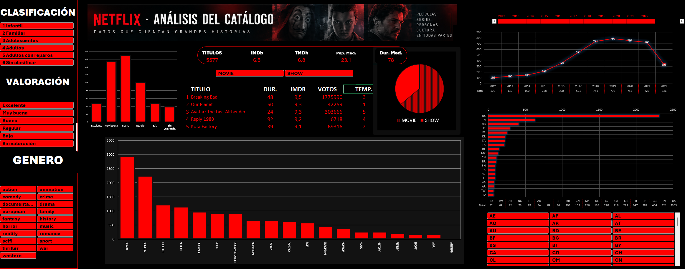

# 📊 Netflix · Análisis del catálogo

Proyecto de análisis de datos desarrollado en **Excel** como parte de la formación de **Data Analyst**.

El objetivo es transformar un dataset de títulos de Netflix en un **dashboard interactivo** que permita explorar el catálogo por tipo de contenido, género, país, clasificación por edad, valoración IMDb y año de estreno.

> El proyecto combina **Power Query**, **Power Pivot**, **DAX**, tablas dinámicas, segmentadores y gráficos dinámicos.

---

## 🎯 Objetivos

- Importar y limpiar los datos con **Power Query**.
- Preparar un modelo de datos consistente para evitar duplicidades en los cálculos.
- Crear medidas con **DAX** para obtener KPIs fiables.
- Construir tablas y gráficos dinámicos.
- Diseñar un dashboard interactivo con filtros y timeline.
- Presentar la información de forma clara, visual y orientada a exploración.

---

## 🗂️ Dataset

El dataset contiene información sobre títulos disponibles en Netflix, incluyendo campos como:

- Título
- Tipo de contenido (`MOVIE` / `SHOW`)
- Año de estreno
- Duración
- Géneros
- Países de producción
- Clasificación por edad
- IMDb score
- IMDb votes
- TMDb score
- TMDb popularity

Durante la transformación, los campos de **géneros** y **países** se normalizaron separando sus valores en filas.

Esto genera varias filas para un mismo título, por lo que los cálculos principales se realizan usando el **ID único del título**.

El modelo final contiene:

- **5.577 títulos únicos**
- **17.382 filas** tras normalizar géneros y países

---

## 🧹 Limpieza y transformación con Power Query

Entre las principales transformaciones realizadas:

- Eliminación de valores vacíos relevantes.
- Limpieza de listas de géneros y países.
- Separación de géneros en filas.
- Separación de países de producción en filas.
- Conversión de tipos de datos.
- Corrección de valores decimales mediante configuración regional.
- Creación de una versión limpia de géneros y países.
- Creación de una representación de duración en formato `HH:MM`.
- Sustitución de clasificaciones de edad vacías por valores informativos.

La tabla transformada se carga posteriormente en el **Modelo de datos de Excel**.

---

## 🧠 Modelo de datos y DAX

Para evitar que la expansión de géneros y países duplique artificialmente las métricas, las medidas se calculan sobre los IDs únicos de los títulos.

### Principales medidas

```DAX
Títulos :=
DISTINCTCOUNT('titles'[id])
```

```DAX
IMDb medio :=
AVERAGEX(
    VALUES('titles'[id]);
    CALCULATE(MAX('titles'[imdb_score]))
)
```

```DAX
TMDb medio :=
AVERAGEX(
    VALUES('titles'[id]);
    CALCULATE(MAX('titles'[tmdb_score]))
)
```

```DAX
Popularidad media :=
AVERAGEX(
    VALUES('titles'[id]);
    CALCULATE(MAX('titles'[tmdb_popularity]))
)
```

```DAX
Duración media :=
AVERAGEX(
    VALUES('titles'[id]);
    CALCULATE(MAX('titles'[runtime]))
)
```

También se crearon variables auxiliares para:

- Clasificación agrupada por edad.
- Orden lógico de categorías.
- Segmentación por nivel de valoración IMDb.
- Timeline centrada en el periodo **2012–2022**.

---

## 📈 Dashboard

El dashboard permite analizar el catálogo mediante diferentes perspectivas.

### KPIs

- Número de títulos
- IMDb medio
- TMDb medio
- Popularidad media
- Duración media

### Visualizaciones

- Evolución de títulos por año
- Distribución por valoración IMDb
- Distribución por género
- Distribución por país
- Reparto entre películas y series
- Top 5 de títulos según valoración IMDb

### Filtros interactivos

El usuario puede filtrar los resultados por:

- Tipo de contenido
- Clasificación por edad
- Valoración IMDb
- Género
- País
- Año de estreno mediante timeline

Los KPIs, tablas y gráficos reaccionan dinámicamente a las selecciones.

---

## 🎨 Diseño

El dashboard utiliza una estética inspirada en Netflix:

- Fondo negro
- Rojo como color de acento
- Texto blanco
- Gráficos y segmentadores personalizados
- Distribución tipo aplicación para facilitar la lectura

La prioridad del diseño es mantener una **jerarquía visual clara** y evitar que la interfaz parezca una hoja de cálculo tradicional.

---

## 🛠️ Tecnologías utilizadas

- Microsoft Excel
- Power Query
- Power Pivot
- DAX
- Tablas dinámicas
- Gráficos dinámicos
- Segmentadores
- Timeline
- Git
- GitHub

---

## 📂 Estructura del repositorio

```text
/
├── README.md
├── RAMON_GOMEZ_FINAL.xlsx
└── data/
    └── titles.csv
```

> La estructura puede variar ligeramente según la versión final de los archivos incluidos en el repositorio.

---

## 🚀 Cómo utilizar el proyecto

1. Descargar o clonar el repositorio.
2. Abrir el archivo Excel.
3. Ir a la hoja **Dashboard**.
4. Utilizar los segmentadores y la timeline para explorar los datos.
5. Usar **Datos → Actualizar todo** si se actualiza la fuente de datos.

---

## 💡 Principales aprendizajes

Este proyecto ha servido para trabajar de forma práctica conceptos como:

- Limpieza y transformación de datos.
- Granularidad de una tabla.
- Diferencia entre filas y entidades únicas.
- Evitar duplicidades en métricas.
- Modelado con Power Pivot.
- Creación de medidas DAX.
- Diseño de dashboards interactivos.
- Uso de filtros cruzados y segmentadores.
- Visualización orientada a preguntas de negocio.

Uno de los puntos más importantes ha sido comprender que, tras normalizar géneros y países, **una fila ya no equivale a un título**. Por ello, las métricas del dashboard trabajan sobre IDs únicos.

---

## 📸 Vista previa


md

```

---

## 👤 Autor

**Ramón Gómez Sánchez**

Proyecto desarrollado como práctica de análisis de datos en Excel.
